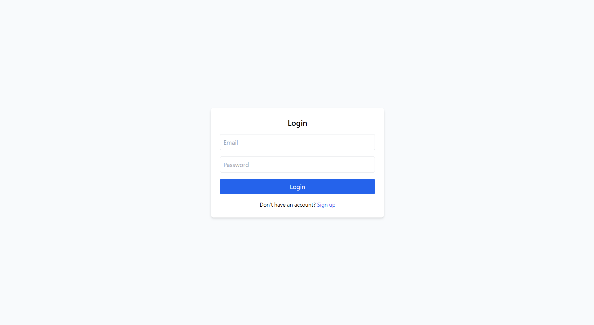
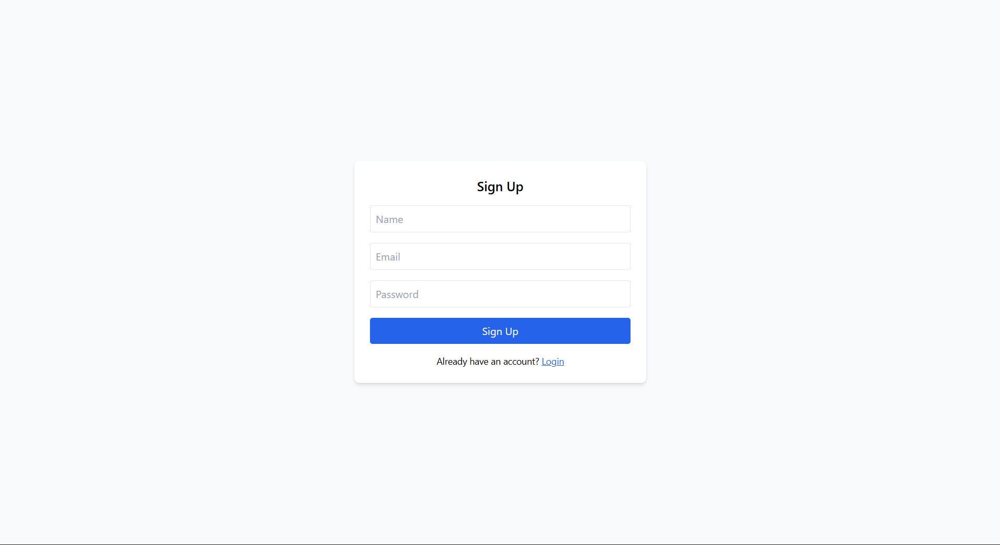
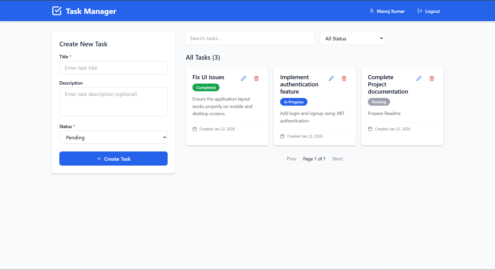
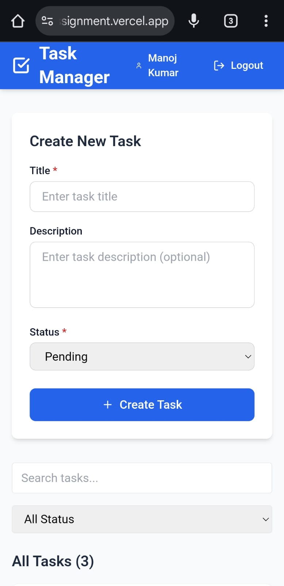
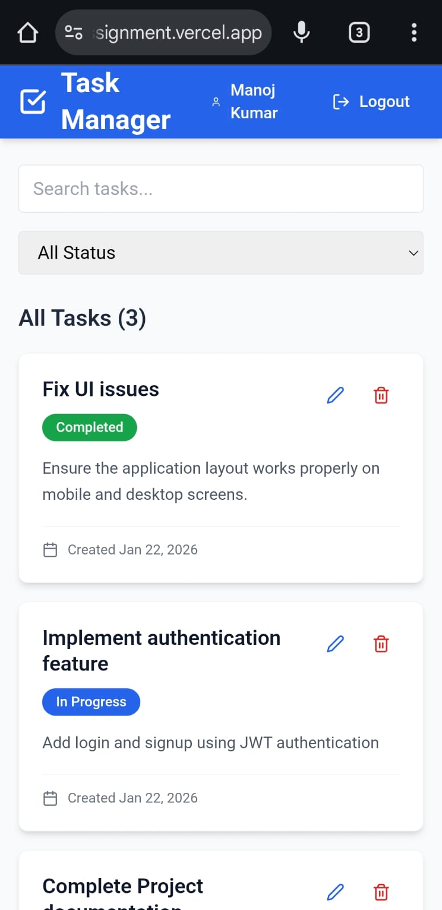
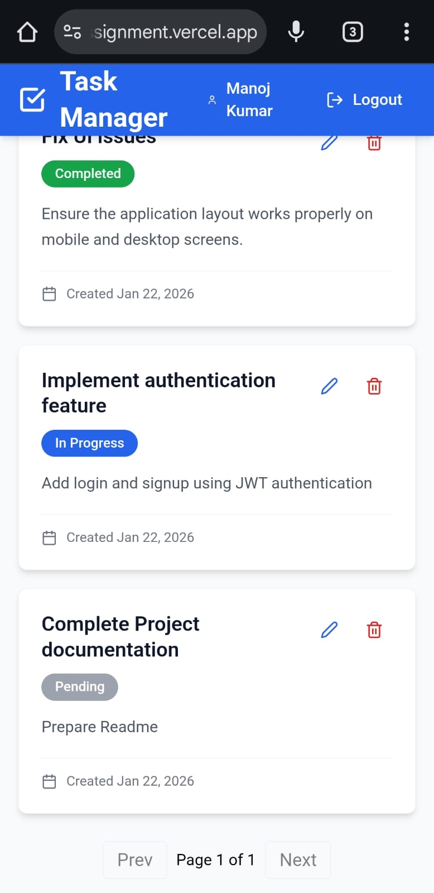

---

# 📋 Backend Intern Assignment – Task Management System

A scalable full-stack Task Management system built as part of a **Backend Developer Intern assignment**.  
The project demonstrates secure authentication, role-based access control, RESTful API design, and a minimal frontend to interact with protected APIs.

The primary focus of this project is **backend architecture, security, and scalability**, with a lightweight frontend for API validation.

---

## 🚀 Core Features

### 🔐 Authentication & Authorization
- User registration and login using **JWT authentication**
- Authorization enforced using middleware based on decoded JWT role
- Secure password hashing using **bcrypt**
- **Role-based access control** (User / Admin)
- Admin users can view all tasks (read-only access)
- Admins can create other admin users via a protected endpoint
- Regular users can only access their own tasks


### 📋 Task Management (CRUD)
- Users can create, update, and delete their own tasks
- User-specific task access enforced at backend
- Admin users can view all tasks across users
- Search tasks by title
- Filter tasks by status (Pending / In Progress / Completed)
- Pagination for large datasets

  
### 👑 Admin Capabilities
- View all tasks across all users (read-only)
- Search and filter tasks globally
- Create other admin users via protected API
- Admin actions secured using JWT role-based authorization


### 🛡️ Security & Best Practices
- Input validation and sanitization
- Protected routes using JWT middleware
- Proper HTTP status codes and error handling
- Environment-based configuration

### 🧪 Developer Experience
- RESTful API design with versioning (`/api/v1`)
- API testing using Postman / Swagger
- Dockerized setup for local development


---
## 📌 Assignment Requirement Coverage

| Requirement | Status |
|------------|--------|
| User registration & login | ✅ Implemented |
| Password hashing & JWT auth | ✅ Implemented |
| Role-based access (User / Admin) | ✅ Implemented |
| CRUD APIs for secondary entity (Tasks) | ✅ Implemented |
| API versioning | ✅ `/api/v1` |
| Error handling & validation | ✅ Implemented |
| API documentation | ✅ Postman / Swagger |
| Database schema | ✅ MongoDB (Mongoose) |
| Basic frontend UI | ✅ React |
| Docker support | ✅ Included |
| Scalability considerations | ✅ Documented |

## 📈 Scalability & Architecture Notes

- Stateless JWT authentication enables horizontal scaling
- Follows separation of concerns to allow easy migration to microservices
- Modular backend architecture (routes, controllers, services, middlewares)
- MongoDB Atlas supports scalable cloud storage
- Docker ensures environment consistency across deployments
- Can be extended with:
  - Redis for caching
  - Microservices architecture
  - Load balancers (Nginx)
  - Rate limiting and centralized logging

## 📘 API Documentation

- All APIs follow REST principles and proper HTTP status codes
- Some endpoints are restricted to admin users only and require an admin JWT token.
- Authentication required via `Authorization: Bearer <JWT>`
- API documentation and testing using Postman (Swagger-ready architecture)

🧪 API Documentation (Postman)

The APIs are fully documented using Postman Documenter, providing a clear and interactive reference for all endpoints.

The documentation covers:

User registration and authentication

Role-based access control (User / Admin)

Task CRUD operations

Admin-only endpoints

Search, filtering, and pagination

🔗 Postman API Documentation:
https://documenter.getpostman.com/view/40196447/2sBXc7MQmY

How to Use

Open the documentation link above

Review request/response examples for each endpoint

Use the documented endpoints directly in Postman or any REST client

Set the base URL to:

http://localhost:5000/api/v1


Authenticate using the login endpoints to obtain a JWT token

Pass the token as Authorization: Bearer <JWT> for protected routes

Note: The documentation is read-only. A Postman collection can be imported or recreated easily using the documented endpoints.


Key Endpoints:
- `POST /api/v1/auth/register` – Register user
- `POST /api/v1/auth/login` – Login user/admin
- `POST /api/v1/auth/register-admin` – Create admin (Admin only)
- `GET /api/v1/tasks` – Get logged-in user's tasks
- `POST /api/v1/tasks` – Create task (User only)
- `PUT /api/v1/tasks/:id` – Update task (User only)
- `DELETE /api/v1/tasks/:id` – Delete task (User only)
- `GET /api/v1/tasks/admin/all` – Get all tasks (Admin only)


## 🛠 Tech Stack

### Frontend

* React (Vite)
* TypeScript
* Tailwind CSS
* Axios

### Backend

* Node.js (v22)
* Express.js
* MongoDB Atlas
* Mongoose
* JWT-based Authentication
* bcrypt

### DevOps & Tools

* Docker & Docker Compose
* Git & GitHub
* Render (Backend deployment)
* Vercel (Frontend deployment)

---

## 📁 Project Structure

```
backend-intern-assignment/
│── frontend/        # React + Vite frontend
│── backend/         # Node.js + Express backend
│── docker-compose.yml
│── README.md
```

---

## ⚙️ Environment Variables

Create `.env` files using the provided `.env.example` files.

### Backend (`backend/.env`)

```env
PORT=5000
MONGO_URI=mongodb+srv://<username>:<password>@cluster.mongodb.net/taskmanager
JWT_SECRET=your_jwt_secret_key
```

### Frontend (`frontend/.env`)

```env
VITE_API_URL=http://localhost:5000
```

---

## ▶️ Project Setup (Without Docker)

### 1️⃣ Clone the Repository

```bash
git clone https://github.com/ManojKumarTadikonda/backend-intern-assignment.git
cd backend-intern-assignment
```

---

### 2️⃣ Backend Setup

```bash
cd backend
npm install
npm start
```

Backend runs at:

```
http://localhost:5000
```

---

### 3️⃣ Frontend Setup

```bash
cd ../frontend
npm install
npm run dev
```

Frontend runs at:

```
http://localhost:5173
```

---

## 🐳 Project Setup (With Docker)

### 1️⃣ Prerequisites

* Docker
* Docker Compose

---

### 2️⃣ Run the Application

From the **project root**:

```bash
docker-compose up --build
```

---

### 3️⃣ Access the Application

| Service  | URL                                            |
| -------- | ---------------------------------------------- |
| Frontend | [http://localhost:3000](http://localhost:3000) |
| Backend  | [http://localhost:5000](http://localhost:5000) |

> Note: When running with Docker, the frontend is served on port 3000.
> When running locally with Vite, it runs on port 5173.


---

## 📑 Logs & API Testing Proof

The `/logs` directory contains:
- Postman screenshots demonstrating authenticated user and admin API access
- Docker build and runtime logs showing successful containerized deployment
- Proof of role-based access control and protected routes

These logs validate correct API behavior, security, and deployment readiness.


## 📸 Screenshots

Below are some screenshots demonstrating the functionality of the application.

### 🔐 Authentication
<p float="left">
  
  
</p>


---

### 📋 Dashboard


---

### 📱 Responsive Design (Mobile)
<p float="left">



</p>


---


## 👤 Author

**Manoj Kumar**  
Full-Stack Developer | Backend-Focused  

